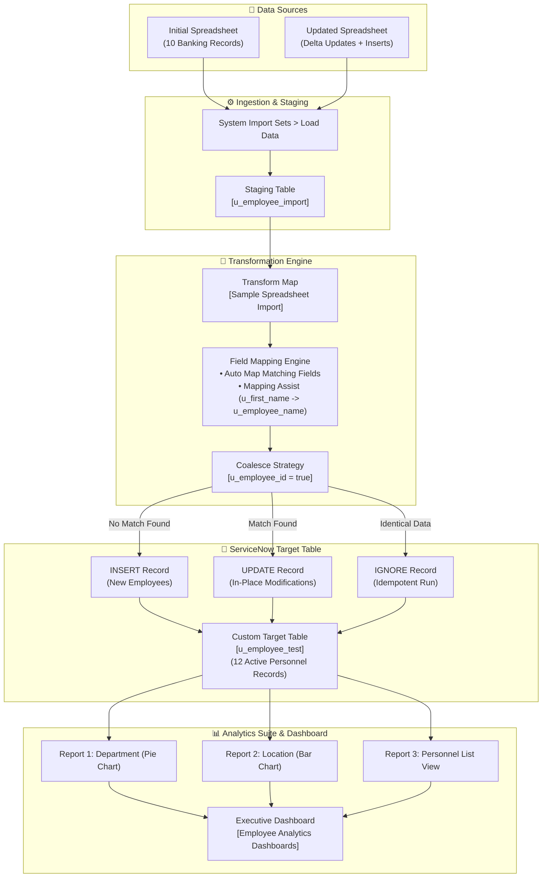

# Import Data Using Transform Maps (Spreadsheet)

[](https://skillwallet.naanmudhalvan.tn.gov.in/)
[](https://www.servicenow.com/)
[](https://github.com/mathesh-gdev/import-data-using-transform-maps-spreadsheet)
[-ff9900?style=for-the-badge)](#)
[](#)

---

## 📌 Executive Summary & Project Overview

This repository documents the implementation of the ServiceNow capstone project: **"Import Data using Transform Maps (Spreadsheet)"**, developed under the **Naan Mudhalvan / SkillWallet** ServiceNow System Administrator program.

The project demonstrates an automated enterprise data migration and analytics pipeline within a **ServiceNow Personal Developer Instance (PDI)** using **Import Sets**, **Transform Maps**, and **Performance Analytics/Dashboards**. 

All **4 Milestones** comprising the full **9 SkillWallet Stories** have been executed and transitioned to **Review (90% Progress)**:
1. **Target Database Architecture:** Custom table definition (`u_employee_test`) and form design.
2. **Staging & Ingestion:** External tabular data staged via Import Sets (`u_employee_import`).
3. **Transform Engine & Mapping:** Field reconciliation using Auto Map and Mapping Assist (`u_first_name` ➔ `u_employee_name`).
4. **Data Deduplication via Coalesce:** Primary key matching on `u_employee_id` with delta stress-testing (validating inserts and in-place updates).
5. **Business Intelligence Suite:** 3 custom operational analytics reports embedded into an interactive Executive Dashboard (`Employee Analytics Dashboards`).

---

## 👥 Team Work Breakdown Structure (SkillWallet Kanban Status)

| Member | Role | Milestone | SkillWallet Stories Owned | Est. Duration | Status |
| :--- | :--- | :--- | :--- | :---: | :---: |
| **Daniel Jeewins J** | Schema & System Specialist | **Milestone 1:** Foundation & Target Schema | • Story 1: Creation Of Spreadsheet<br>• Story 2: Creation of Tables | 4h 20m | `UNDER REVIEW` 🔍 |
| **Vishal K** | Import Set & Mapping Specialist | **Milestone 2:** Staging & Transform Mapping | • Story 3: Create Importset Table<br>• Story 4: Create Transform Map | 6h 00m | `UNDER REVIEW` 🔍 |
| **Mathesh G** *(Lead)* | Team Lead & Integration Specialist | **Milestone 3:** Execution, Coalesce & Stress Validation | • Story 5: Transform Data & Validate<br>• Story 6: Enable Coalesce to Avoid Duplicates<br>• Story 7: Inserting New Data In Excel Format | 10h 00m | `UNDER REVIEW` 🔍 |
| **Manikandan S** | Analytics & Dashboard Specialist | **Milestone 4:** Reporting Suite & Dashboard | • Story 8: Report 1 (3 Analytics Reports)<br>• Story 9: Adding Reports to Dashboard | 6h 00m | `UNDER REVIEW` 🔍 |

---

## 🏗️ End-to-End Architecture Workflow



---

## 📂 Active Repository Structure

```text
.
├── README.md                               # Comprehensive capstone report & evaluator guide
├── .gitignore                              # Clean ignore rules for temporary & OS files
├── dataset/
│   └── Sample Spreadsheet.xlsx             # Source Excel dataset (updated with 12 employee records)
└── screenshots/
    ├── 01_custom_table_schema.png          # Milestone 1: Target table schema (u_employee_test)
    ├── 02_form_layout_fields.png           # Milestone 1: Form view layout configuration
    ├── 03_load_data_import_set.png         # Milestone 2: Initial staging table load (10 rows)
    ├── 04_transform_map_field_mapping.png  # Milestone 2: Transform Map & field mapping
    ├── 05_transform_execution_complete.png # Milestone 3: Initial transform run (10 inserts)
    ├── 06_target_table_records_verified.png# Milestone 3: Target table list verification (10 rows)
    ├── 07_coalesce_enabled.png             # Milestone 3: Coalesce flag enabled on u_employee_id
    ├── 08_new_data_import_loaded.png       # Milestone 3: Load Data for updated spreadsheet
    ├── 09_coalesce_transform_results.png   # Milestone 3: Transform execution results
    ├── 10_updated_target_records_verified.png # Milestone 3: Final verified records (12 rows)
    ├── 11_report_employees_by_department.png # Milestone 4: Employees by Department Pie Chart
    ├── 12_report_employees_by_location.png   # Milestone 4: Employees by Location Bar Chart
    └── 13_employee_analytics_dashboard.png # Milestone 4: Executive Employee Analytics Dashboard
```

---

## 📑 Milestone Implementation Details

### Milestone 1: Foundation & Target Schema
**Owner:** `Daniel Jeewins J` | **SkillWallet Stories:** `Creation Of Spreadsheet`, `Creation of Tables`

#### 1. Baseline Dataset Authoring
- Authored initial [`dataset/Sample Spreadsheet.xlsx`](dataset/Sample%20Spreadsheet.xlsx) with 10 structured employee records.
- Standardized header schema in Row 1: `Employee ID` | `First Name` | `Last Name` | `Email` | `Department` | `Location`.

#### 2. Target Table Architecture (`u_employee_test`)
- **Navigation:** System Definition > Tables (`sys_db_object.list`) > New.
- **Table Label:** `Employee Test` | **Table Name:** `u_employee_test` | **Application Scope:** Global.
- Configured 5 custom database columns in the dictionary:

| Column Label | Column Name | Data Type | Max Length | Mandatory | System Purpose |
| :--- | :--- | :--- | :---: | :---: | :--- |
| **Employee ID** | `u_employee_id` | String | 40 | Yes | Unique corporate employee identifier (Coalesce Key) |
| **Employee Name** | `u_employee_name` | String | 100 | Yes | Full employee display name |
| **Email** | `u_email` | String | 100 | No | Corporate communication address |
| **Department** | `u_department` | String | 100 | No | Operational business unit |
| **Location** | `u_location` | String | 100 | No | Primary office branch location |


*Figure 1.1: Target table dictionary schema showing all 5 custom string columns.*

#### 3. Form Design & Layout Configuration
- Customized default form layout via **Configure > Form Design** on `u_employee_test`.
- Positioned primary identifiers (`Employee ID`, `Employee Name`) at the top, followed by `Email`, `Department`, and `Location` in a structured layout.


*Figure 1.2: Form view layout displaying all 5 custom attributes on the main form view.*

---

### Milestone 2: Staging Table & Transform Mapping
**Owner:** `Vishal K` | **SkillWallet Stories:** `Create Importset Table`, `Create Transform Map`

#### 1. Import Set Staging (`u_employee_import`)
- **Navigation:** System Import Sets > Load Data.
- Uploaded [`dataset/Sample Spreadsheet.xlsx`](dataset/Sample%20Spreadsheet.xlsx) to create a new staging table:
  - **Staging Table Label:** `Employee Import`
  - **Staging Table Name:** `u_employee_import`
  - **Header Row:** 1 | **Sheet Number:** 1
- **Ingestion Result:** 10 records loaded into the staging table with 0 errors.


*Figure 2.1: Load Data confirmation displaying 10 records loaded into staging table u_employee_import.*

#### 2. Transform Map Configuration (`Sample Spreadsheet Import`)
- **Navigation:** System Import Sets > Administration > Transform Maps.
- **Transform Map Name:** `Sample Spreadsheet Import`
- **Source Table:** `Employee Import` [`u_employee_import`]
- **Target Table:** `Employee Test` [`u_employee_test`]
- **Field Mapping Methodology:**
  - Automated matching generated via **Auto Map Matching Fields**.
  - Reconciled field name divergence using **Mapping Assist** to bridge source `u_first_name` directly to target `u_employee_name`.

| # | Source Field (`u_employee_import`) | Target Field (`u_employee_test`) | Mapping Method | Initial Coalesce |
| :-: | :--- | :--- | :--- | :-: |
| 1 | `u_employee_id` | `u_employee_id` | Auto Map Matching Fields | False |
| 2 | `u_first_name` | `u_employee_name` | Mapping Assist | False |
| 3 | `u_email` | `u_email` | Auto Map Matching Fields | False |
| 4 | `u_department` | `u_department` | Auto Map Matching Fields | False |
| 5 | `u_location` | `u_location` | Auto Map Matching Fields | False |


*Figure 2.2: Field Maps list displaying complete field relationship definitions.*

---

### Milestone 3: Execution, Coalesce Strategy & Stress Validation
**Owner:** `Mathesh G (Team Lead)` | **SkillWallet Stories:** `Transform Data & Validate`, `Enable Coalesce to Avoid Duplicate Records`, `Inserting New Data In Excel Format`

#### 1. Initial Transformation Execution & Validation (Story 5)
- **Navigation:** System Import Sets > Run Transform.
- Executed transform using `Sample Spreadsheet Import`.
- **Metrics:** **10 Inserts**, **0 Updates**, **0 Errors**, State = Complete.
- Verified in `u_employee_test.list` that all 10 baseline records were created accurately.


*Figure 3.1: Initial transformation execution history confirming 10 Inserts and 0 Errors.*


*Figure 3.2: Target table list view (u_employee_test.list) verifying all 10 baseline records.*

#### 2. Enabling Coalesce to Prevent Duplicate Records (Story 6)
- **Navigation:** System Import Sets > Administration > Transform Maps > `Sample Spreadsheet Import` > Field Maps.
- Opened the field map for `u_employee_id` and set **Coalesce = true**.
- **Technical Explanation:** Setting `Coalesce = true` instructs the ServiceNow transform engine to treat `u_employee_id` as the primary key match condition. During transformation, ServiceNow executes an internal query against `u_employee_test`:
  - If a matching `u_employee_id` exists ➔ **UPDATE** the existing record in-place.
  - If no match exists ➔ **INSERT** a new record.
  - If the data is identical ➔ **IGNORE** (no needless database writes).
  This prevents duplicate personnel profiles during repetitive bulk data syncs.


*Figure 3.3: Field Maps list displaying Coalesce = true configured on u_employee_id.*

#### 3. Inserting New Data in Excel Format & Stress Testing (Story 7)
- Prepared an updated spreadsheet containing modified existing records and brand-new employee profiles:
  - **Updated Existing Record 1 (`SB-0004`):** Name updated to `Ajay Kumar`.
  - **Updated Existing Record 2 (`SB-0007`):** Email updated to `test18@gmail.com` (from `test10@gmail.com`).
  - **New Insert 1 (`SB-0011`):** `Suresh K` (Operations, Chennai).
  - **New Insert 2 (`SB-0012`):** `Meena R` (Human Resources, Bangalore).
- Loaded data into existing staging table `u_employee_import` and executed `Run Transform`.
- **Validation Results:**
  - Staging load: Confirmed records loaded into staging table.
  - Transform Results: Existing records updated, new records inserted without errors.
  - Target Table Verification: Navigation to `u_employee_test.list` confirmed **12 total records** with all modifications reflected in-place.


*Figure 3.4: Load Data screen showing updated spreadsheet loaded into staging table.*


*Figure 3.5: Transform execution history displaying successful updates and inserts.*

#### 4. Final Target Table Record Verification (`u_employee_test.list`)

| Employee ID | Employee Name | Email | Department | Location | Status / Action |
| :--- | :--- | :--- | :--- | :--- | :--- |
| `SB-0004` | Ajay Kumar | `ajay@testbank.com` | Retail Banking | Chennai | **Updated (Name)** |
| `SB-0007` | Raviteja | `test18@gmail.com` | Risk & Compliance | Bangalore | **Updated (Email)** |
| `SB-0001` | Rajesh | `rajesh.s@testbank.com` | IT & Systems | Mumbai | Baseline Record |
| `SB-0002` | Priya | `priya.n@testbank.com` | Human Resources | Chennai | Baseline Record |
| `SB-0003` | Amit | `amit.p@testbank.com` | Corporate Finance | Mumbai | Baseline Record |
| `SB-0005` | Sneha | `sneha.r@testbank.com` | Wealth Management | Hydrabad | Baseline Record |
| `SB-0006` | Vikram | `vikram.s@testbank.com` | Retail Banking | Delhi | Baseline Record |
| `SB-0008` | Ananya | `ananya.d@testbank.com` | IT & Systems | Bangalore | Baseline Record |
| `SB-0009` | Karthik | `karthik.m@testbank.com` | Operations | Chennai | Baseline Record |
| `SB-0010` | Divya | `divya.m@testbank.com` | Credit Cards | Kochi | Baseline Record |
| `SB-0011` | Suresh | `suresh.k@testbank.com` | Operations | Chennai | **New Insert** |
| `SB-0012` | Meena | `meena.r@testbank.com` | Human Resources | Bangalore | **New Insert** |


*Figure 3.6: Final u_employee_test.list view displaying all 12 records with updates applied.*

---

### Milestone 4: Reporting Suite & Executive Dashboard
**Owner:** `Manikandan S` | **SkillWallet Stories:** `Report 1`, `Adding Reports to Dashboard`

#### 1. Business Intelligence Reports Configuration (Story 8)
Configured three specialized analytics reports on table `u_employee_test` via **Reports > Create New** (`sys_report_template.do`):

| Report Name | Chart Type | Data Source | Group By / Aggregation | Analytical Purpose |
| :--- | :--- | :--- | :--- | :--- |
| **Employees by Department** | Pie Chart | `u_employee_test` | Group by: `u_department` (Count) | Visualizes workforce allocation across organizational business units |
| **Employees by Location** | Bar Chart | `u_employee_test` | Group by: `u_location` (Count) | Highlights geographical distribution across regional offices |
| **Employee List Report** | List View | `u_employee_test` | Columns: ID, Name, Email, Dept, Location | Delivers an operational, sortable roster table view |


*Figure 4.1: Report 1 - Employees by Department (Pie Chart visualization).*


*Figure 4.2: Report 2 - Employees by Location (Bar Chart distribution).*

#### 2. Executive Dashboard Assembly & Embedding (Story 9)
- **Navigation:** Self-Service > Dashboards (or `pa_dashboards.list`) > New.
- **Dashboard Name:** `Employee Analytics Dashboards`.
- **Layout Architecture:**
  - **Top-Left Container:** `Employees by Department` (Pie Chart).
  - **Top-Right Container:** `Employees by Location` (Bar Chart).
  - **Bottom Span Container:** `Employee List Report` (Interactive Multi-column Table).


*Figure 4.3: Executive Employee Analytics Dashboard consolidating all 3 reports.*

---

## 🎬 3-Minute Video Demo Presentation Script

For faculty evaluation and video submission (via Loom / YouTube), follow this structured screen walkthrough:

| Timestamp | Topic | Narration & Screen Walkthrough Action |
| :---: | :--- | :--- |
| **0:00 - 0:30** | **Intro & SkillWallet Kanban** | *"Hi, I am Mathesh G, Team Lead. This is our ServiceNow capstone project: Import Data using Transform Maps. Our team includes Daniel, Vishal, and Manikandan."*<br>• Display SkillWallet Kanban board with all 9 stories in `REVIEW / COMPLETED` status. |
| **0:30 - 1:00** | **Spreadsheet & Target Table** | *"Daniel authored our baseline dataset and constructed target table `u_employee_test`."*<br>• Show `Sample Spreadsheet.xlsx` in Excel.<br>• Switch to ServiceNow and display `u_employee_test.list` with all 5 columns populated. |
| **1:00 - 1:45** | **Transform Map & Coalesce** | *"Vishal set up staging table `u_employee_import` and the Transform Map with Mapping Assist for name fields."*<br>• Open `Sample Spreadsheet Import` Transform Map.<br>• Highlight `Field Maps` and emphasize `u_employee_id` with `Coalesce = true` for automated deduplication. |
| **1:45 - 2:30** | **Coalesce Proof & History** | *"To stress-test Coalesce, I ingested an updated sheet with modified records and new personnel."*<br>• Open Transform History showing inserts and in-place updates without duplicate records.<br>• Display `u_employee_test.list` verifying all 12 personnel records with updated profiles. |
| **2:30 - 3:00** | **Executive Dashboard & Wrap-Up** | *"Manikandan consolidated our workforce data into business intelligence visualizations."*<br>• Open `Employee Analytics Dashboards` displaying the Department Pie Chart, Location Bar Chart, and List Report.<br>• Conclude presentation and thank evaluators. |

---

## ✅ Quality Assurance & Verification Checklist

- [x] All team members accepted SkillWallet invitations; Team Lead unlocked Kanban board.
- [x] Baseline dataset [`dataset/Sample Spreadsheet.xlsx`](dataset/Sample%20Spreadsheet.xlsx) authored with 10 records.
- [x] Target table `u_employee_test` created with 5 custom string columns.
- [x] Form view configured placing all 5 custom fields cleanly.
- [x] Staging table `u_employee_import` created and loaded via Load Data.
- [x] Transform Map configured with Auto Map and Mapping Assist (`u_first_name` ➔ `u_employee_name`).
- [x] Initial transform completed with 10 Inserts and 0 Errors.
- [x] `u_employee_id` set to `Coalesce = true`.
- [x] Stress-test dataset ingested: verified inserts and in-place updates.
- [x] 3 Analytics Reports configured (Department Pie Chart, Location Bar Chart, List Report).
- [x] Executive Dashboard `Employee Analytics Dashboards` created with all 3 widgets embedded.
- [x] All 9 SkillWallet stories transitioned to `UNDER REVIEW`.
- [x] Git repository pushed with datasets, documentation, and screenshots.

---

## 🔗 Project Resources & References

| Resource | Link |
| :--- | :--- |
| 📹 **Project Demo Video (Loom / YouTube)** | [Project Demo Video Walkthrough (Placeholder)](https://youtu.be/placeholder) |
| 💻 **GitHub Repository** | [mathesh-gdev/import-data-using-transform-maps-spreadsheet](https://github.com/mathesh-gdev/import-data-using-transform-maps-spreadsheet) |
| 📊 **Source Dataset (Updated - 12 Rows)** | [dataset/Sample Spreadsheet.xlsx](dataset/Sample%20Spreadsheet.xlsx) |

---
*Created for the **Naan Mudhalvan - SkillWallet** Initiative \| ServiceNow System Administrator Track*
