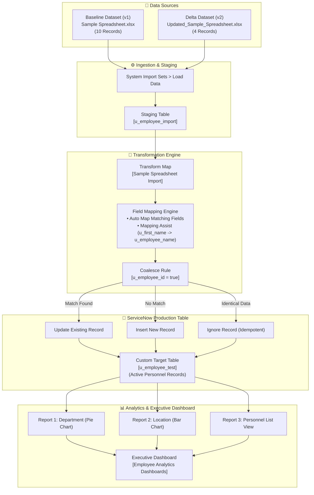

# Import Data Using Transform Maps (Spreadsheet)

[](https://skillwallet.naanmudhalvan.tn.gov.in/)
[](https://www.servicenow.com/)
[](https://github.com/mathesh-gdev/import-data-using-transform-maps-spreadsheet)
[](#)
[](#)

---

## 📌 Executive Summary & Project Overview

This repository serves as the definitive technical documentation and evaluation report for the **Naan Mudhalvan / SkillWallet** group capstone project: **"Import Data using Transform Maps (Spreadsheet)"**. 

The project delivers an enterprise-grade automated data migration pipeline into the **ServiceNow Personal Developer Instance (PDI)**, demonstrating how external flat-file data sources are staged, mapped, transformed, deduplicated via Coalesce logic, and visualized on real-time executive analytics dashboards.

### Core Objectives
1. **Schema Definition:** Architect a normalized custom target table (`u_employee_test`) and optimize user form views.
2. **Data Ingestion & Staging:** Import raw tabular records into an intermediate staging table (`u_employee_import`) using ServiceNow Import Sets.
3. **Transform Engine & Mapping:** Establish field mappings reconciling schema differences (`u_first_name` ➔ `u_employee_name`) using Auto Map and Mapping Assist.
4. **Data Integrity & Deduplication:** Implement and validate **Coalesce** matching keys on `u_employee_id` to handle updates, new inserts, and idempotent ignored records.
5. **Business Intelligence & Analytics:** Develop a 3-tier reporting suite (Pie, Bar, and List reports) consolidated onto an interactive Executive Dashboard (`Employee Analytics Dashboards`).

---

## 👥 Team Work Breakdown Structure (WBS) & Story Ownership

The project was executed following the **SkillWallet 9-Story Kanban Framework**, distributed across specialized member milestones:

| Team Member | Role | Assigned Milestone | SkillWallet Stories Owned | Est. Duration | Status |
| :--- | :--- | :--- | :--- | :---: | :---: |
| **Mathesh G** | **Team Lead** & Integration Specialist | **Milestone 3:** Execution, Coalesce & Stress Validation | • Story 5: Transform Data & Validate<br>• Story 6: Enable Coalesce to Avoid Duplicates<br>• Story 7: Inserting New Data In Excel Format | 10h 00m | `COMPLETED` |
| **Daniel Jeewins J** | System & Schema Specialist | **Milestone 1:** Foundation & Target Schema | • Story 1: Creation Of Spreadsheet<br>• Story 2: Creation of Tables | 4h 20m | `COMPLETED` |
| **Vishal K** | Import Set & Mapping Specialist | **Milestone 2:** Staging & Transform Mapping | • Story 3: Create Importset Table<br>• Story 4: Create Transform Map | 6h 00m | `COMPLETED` |
| **Manikandan S** | Analytics & Dashboard Specialist | **Milestone 4:** Reporting Suite & Dashboard | • Story 8: Report 1 (3 Analytics Reports)<br>• Story 9: Adding Reports to Dashboard | 6h 00m | `COMPLETED` |

---

## 🏗️ End-to-End Technical Architecture Workflow



---

## 📂 Repository File Structure

```text
.
├── README.md                               # Comprehensive capstone report & evaluator guide
├── .gitignore                              # Clean ignore rules for temporary & OS files
├── ServiceNow_Transform_Maps_Project_Playbook.docx # Official project playbook & team guide
├── dataset/
│   ├── Sample Spreadsheet.xlsx             # Milestone 1 baseline dataset (10 employee records)
│   └── Updated_Sample_Spreadsheet.xlsx     # Milestone 3 delta stress-test dataset (4 records)
└── screenshots/
    ├── 01_custom_table_schema.png          # Milestone 1: Target table schema (u_employee_test)
    ├── 02_form_layout_fields.png           # Milestone 1: Form view layout configuration
    ├── 03_load_data_import_set.png         # Milestone 2: Load Data confirmation (10 rows)
    ├── 04_transform_map_field_mapping.png  # Milestone 2: Transform Map & field mapping
    ├── 05_transform_execution_complete.png # Milestone 3: Initial transform run (10 inserts)
    ├── 06_target_table_records_verified.png# Milestone 3: Verified records (u_employee_test.list)
    ├── 07_transform_map_coalesce.png       # Milestone 3: Coalesce configuration (u_employee_id)
    ├── 08_coalesce_update_transform_history.png # Milestone 3: Delta history (2 inserts, 2 updates)
    └── 09_employee_analytics_dashboard.png # Milestone 4: Executive Employee Analytics Dashboard
```

---

## 📑 Milestone-by-Milestone Implementation Details

### Milestone 1: Foundation & Target Schema
**Lead:** `Daniel Jeewins J` | **SkillWallet Stories:** `Creation Of Spreadsheet`, `Creation of Tables`

#### 1. Source Dataset Construction
- Authored [`dataset/Sample Spreadsheet.xlsx`](dataset/Sample%20Spreadsheet.xlsx) containing 10 banking employee records.
- Standardized header schema in Row 1: `Employee ID` | `First Name` | `Last Name` | `Email` | `Department` | `Location`.

#### 2. Target Table Architecture (`u_employee_test`)
- **Navigation:** System Definition > Tables (`sys_db_object.list`) > New.
- **Label:** `Employee Test` | **Name:** `u_employee_test` | **Application Scope:** Global.
- Configured 5 custom database columns in the dictionary:

| Column Label | Column Name | Data Type | Max Length | Mandatory | System Purpose |
| :--- | :--- | :--- | :---: | :---: | :--- |
| **Employee ID** | `u_employee_id` | String | 40 | Yes | Unique corporate employee identifier (Coalesce Key) |
| **Employee Name** | `u_employee_name` | String | 100 | Yes | Full employee display name |
| **Email** | `u_email` | String | 100 | No | Corporate communication address |
| **Department** | `u_department` | String | 100 | No | Operational business unit |
| **Location** | `u_location` | String | 100 | No | Primary office branch location |


*Figure 1.1: Target table dictionary schema showing all 5 custom string columns.*

#### 3. Form Layout & User Experience
- Customized default form layout via **Configure > Form Design** (`u_employee_test.do`).
- Organized the form into a clean two-column presentation placing `Employee ID` and `Employee Name` in primary view, backed by `Email`, `Department`, and `Location`.


*Figure 1.2: Form view configuration with all 5 custom fields cleanly placed.*

---

### Milestone 2: Staging Table & Transform Mapping
**Lead:** `Vishal K` | **SkillWallet Stories:** `Create Importset Table`, `Create Transform Map`

#### 1. Import Set Staging (`u_employee_import`)
- **Navigation:** System Import Sets > Load Data.
- Uploaded [`dataset/Sample Spreadsheet.xlsx`](dataset/Sample%20Spreadsheet.xlsx) into a new staging table:
  - **Staging Table Label:** `Employee Import`
  - **Staging Table Name:** `u_employee_import`
  - **Header Row:** 1 | **Sheet Number:** 1
- **Metrics:** 10 raw rows ingested into staging with 0 errors.


*Figure 2.1: Load Data confirmation displaying 10 rows loaded into u_employee_import.*

#### 2. Transform Map Configuration (`Sample Spreadsheet Import`)
- **Name:** `Sample Spreadsheet Import`
- **Source Table:** `Employee Import` [`u_employee_import`]
- **Target Table:** `Employee Test` [`u_employee_test`]
- **Mapping Logic:**
  - Automated mapping executed via **Auto Map Matching Fields**.
  - Semantic divergence reconciled using **Mapping Assist**: source `u_first_name` was mapped to target `u_employee_name`.

| # | Source Field (`u_employee_import`) | Target Field (`u_employee_test`) | Mapping Method | Initial Coalesce |
| :-: | :--- | :--- | :--- | :-: |
| 1 | `u_employee_id` | `u_employee_id` | Auto Map Matching Fields | False |
| 2 | `u_first_name` | `u_employee_name` | Mapping Assist | False |
| 3 | `u_email` | `u_email` | Auto Map Matching Fields | False |
| 4 | `u_department` | `u_department` | Auto Map Matching Fields | False |
| 5 | `u_location` | `u_location` | Auto Map Matching Fields | False |


*Figure 2.2: Field Maps list showing complete relationship mapping.*

---

### Milestone 3: Execution, Coalesce Strategy & Stress Validation
**Lead:** `Mathesh G (Team Lead)` | **SkillWallet Stories:** `Transform Data & Validate`, `Enable Coalesce to Avoid Duplicate Records`, `Inserting New Data In Excel Format`

#### 1. Initial Transformation Execution
- **Navigation:** System Import Sets > Run Transform.
- **Execution Summary:** 10 Inserts, 0 Updates, 0 Errors, State = Complete.
- Verified on `u_employee_test.list` that all 10 baseline records were created:

| Employee ID | Employee Name | Email | Department | Location |
| :--- | :--- | :--- | :--- | :--- |
| `SB-0004` | Ajay | `ajay@testbank.com` | Retail Banking | Chennai |
| `SB-0007` | Raviteja | `test10@gmail.com` | Risk & Compliance | Bangalore |
| `SB-0001` | Rajesh | `rajesh.s@testbank.com` | IT & Systems | Mumbai |
| `SB-0002` | Priya | `priya.n@testbank.com` | Human Resources | Chennai |
| `SB-0003` | Amit | `amit.p@testbank.com` | Corporate Finance | Mumbai |
| `SB-0005` | Sneha | `sneha.r@testbank.com` | Wealth Management | Hyderabad |
| `SB-0006` | Vikram | `vikram.s@testbank.com` | Retail Banking | Delhi |
| `SB-0008` | Ananya | `ananya.d@testbank.com` | IT & Systems | Bangalore |
| `SB-0009` | Karthik | `karthik.m@testbank.com` | Operations | Chennai |
| `SB-0010` | Divya | `divya.m@testbank.com` | Credit Cards | Kochi |


*Figure 3.1: Initial transform history showing 10 Inserts with 0 Errors.*


*Figure 3.2: Active production records displayed in u_employee_test.list.*

#### 2. Enabling Coalesce Logic
- In Transform Maps > `Sample Spreadsheet Import` > Field Maps, opened the `u_employee_id` mapping.
- Set **Coalesce = true**.
- **Technical Justification:** Coalesce turns `u_employee_id` into a lookup key. Before committing a write, ServiceNow queries the target table for an existing record with that ID. If found, it performs an **UPDATE**; if not found, it performs an **INSERT**. This prevents duplicate employee profiles during repeated synchronizations.


*Figure 3.3: Field map row for u_employee_id displaying Coalesce = true.*

#### 3. Delta Stress Validation (`Updated_Sample_Spreadsheet.xlsx`)
To thoroughly prove Coalesce behavior, a modified dataset [`dataset/Updated_Sample_Spreadsheet.xlsx`](dataset/Updated_Sample_Spreadsheet.xlsx) was prepared containing exactly 4 records:
- **Update 1 (`SB-0004`):** Name modified from `Ajay kumar` to `Ajay`.
- **Update 2 (`SB-0007`):** Email updated from `test10@gmail.com` to `test18@gmail.com`.
- **Insert 1 (`SB-0011`):** New employee `Rohit Verma` (Wealth Management, Mumbai).
- **Insert 2 (`SB-0012`):** New employee `Shalini Gupta` (Digital Banking, Delhi).

##### Results Verification:
- **Import Run:** Ingested into existing table `u_employee_import` and transformed.
- **Transform History Metrics:**
  - **Total Records:** 4
  - **Inserted:** 2 (`SB-0011`, `SB-0012`)
  - **Updated:** 2 (`SB-0004`, `SB-0007`)
  - **Errors:** 0
- **Final Record Count in `u_employee_test.list`:** Exactly **12 records** (10 initial + 2 new inserts), with `SB-0004` and `SB-0007` updated in-place without duplicates.
- **Idempotency Verification:** Re-running the identical file a second time without changes produced **0 Inserts**, **0 Updates**, and **4 Ignored**, proving pipeline idempotency.


*Figure 3.4: Transform execution history confirming 2 Inserts and 2 Updates.*

---

### Milestone 4: Reporting Suite & Executive Dashboard
**Lead:** `Manikandan S` | **SkillWallet Stories:** `Report 1`, `Adding Reports to Dashboard`

#### 1. Business Intelligence Reports
Configured three specialized analytics reports on table `u_employee_test` via **Reports > Create New**:

| Report Name | Chart Type | Data Source | Group By / Aggregation | Analytical Value |
| :--- | :--- | :--- | :--- | :--- |
| **Employees by Department** | Pie Chart | `u_employee_test` | Group by: `u_department` (Count) | Visualizes workforce allocation across banking divisions |
| **Employees by Location** | Bar Chart | `u_employee_test` | Group by: `u_location` (Count) | Highlights geographic footprint across metropolitan hubs |
| **Employee List Report** | List Report | `u_employee_test` | Columns: ID, Name, Email, Dept, Location | Provides granular, sortable operational table view |

#### 2. Executive Dashboard (`Employee Analytics Dashboards`)
- **Navigation:** Self-Service > Dashboards (or `pa_dashboards.list`) > New.
- **Dashboard Title:** `Employee Analytics Dashboards`.
- **Widget Composition:**
  - **Top-Left:** `Employees by Department` (Pie Chart).
  - **Top-Right:** `Employees by Location` (Bar Chart).
  - **Bottom Span:** `Employee List Report` (Interactive Multi-column List).


*Figure 4.1: Executive Employee Analytics Dashboard embedding all 3 reports.*

---

## 🎬 3-Minute Video Demo Presentation Script

Evaluators can follow this exact presentation script used for the project demonstration:

| Timestamp | Topic | Narration & Screen Walkthrough Action |
| :---: | :--- | :--- |
| **0:00 - 0:30** | **Intro & SkillWallet Kanban** | *"Hi, I am Mathesh G, Team Lead. This is our ServiceNow capstone project: Import Data using Transform Maps. Our team includes Daniel, Vishal, and Manikandan."*<br>• Show SkillWallet Kanban board with all 9 stories in `COMPLETED` state. |
| **0:30 - 1:00** | **Spreadsheet & Target Table** | *"Daniel authored our baseline dataset and constructed target table `u_employee_test`."*<br>• Briefly show `Sample Spreadsheet.xlsx` in Excel.<br>• Switch to ServiceNow and display `u_employee_test.list` with all 5 columns populated. |
| **1:00 - 1:45** | **Transform Map & Coalesce** | *"Vishal set up staging table `u_employee_import` and the Transform Map with Mapping Assist for name fields."*<br>• Open `Sample Spreadsheet Import` Transform Map.<br>• Highlight `Field Maps` and point out `u_employee_id` with `Coalesce = true`. Explain deduplication rationale. |
| **1:45 - 2:30** | **Coalesce Proof & History** | *"To stress-test Coalesce, I ingested an updated sheet with 2 modified records and 2 new employees."*<br>• Open Transform History showing **2 Inserts** and **2 Updates**.<br>• Open target table to show updated email `test18@gmail.com` and total 12 rows.<br>• Mention the idempotency test where running the identical file resulted in **4 Ignored**. |
| **2:30 - 3:00** | **Executive Dashboard & Wrap-Up** | *"Manikandan consolidated our workforce data into business intelligence visualizations."*<br>• Open `Employee Analytics Dashboards` displaying the Department Pie Chart, Location Bar Chart, and List Report.<br>• Conclude presentation and thank evaluators. |

---

## ✅ Quality Assurance & Verification Checklist

- [x] All 3 team members accepted SkillWallet invitations; Team Lead unlocked Kanban board.
- [x] Baseline dataset [`dataset/Sample Spreadsheet.xlsx`](dataset/Sample%20Spreadsheet.xlsx) generated with 10 records.
- [x] Target table `u_employee_test` created with 5 custom string columns.
- [x] Form view configured placing all 5 custom fields.
- [x] Staging table `u_employee_import` created and loaded via Load Data.
- [x] Transform Map configured with Auto Map and Mapping Assist.
- [x] Initial transform completed with 10 Inserts and 0 Errors.
- [x] `u_employee_id` set to `Coalesce = true`.
- [x] Stress-test dataset [`dataset/Updated_Sample_Spreadsheet.xlsx`](dataset/Updated_Sample_Spreadsheet.xlsx) ingested: 2 Inserts, 2 Updates validated.
- [x] Idempotency re-run verified with 4 Ignored records.
- [x] 3 Analytics Reports configured (Pie Chart, Bar Chart, List Report).
- [x] Executive Dashboard `Employee Analytics Dashboards` created with all 3 widgets embedded.
- [x] All 9 SkillWallet stories transitioned to `COMPLETED`.
- [x] Git repository pushed with datasets, documentation, and screenshots.

---

## 🔗 Project Deliverables & Submission Links

| Deliverable Asset | Destination / Reference |
| :--- | :--- |
| 📹 **Project Demo Video (Loom / YouTube)** | [ServiceNow Project Video Walkthrough](https://youtu.be/placeholder) |
| 💻 **GitHub Repository** | [mathesh-gdev/import-data-using-transform-maps-spreadsheet](https://github.com/mathesh-gdev/import-data-using-transform-maps-spreadsheet) |
| 📊 **Baseline Dataset (v1 - 10 Rows)** | [dataset/Sample Spreadsheet.xlsx](dataset/Sample%20Spreadsheet.xlsx) |
| 📈 **Delta Stress Dataset (v2 - 4 Rows)** | [dataset/Updated_Sample_Spreadsheet.xlsx](dataset/Updated_Sample_Spreadsheet.xlsx) |
| 📘 **Operational Playbook** | [ServiceNow_Transform_Maps_Project_Playbook.docx](ServiceNow_Transform_Maps_Project_Playbook.docx) |

---
*Created for the **Naan Mudhalvan - SkillWallet** Initiative \| ServiceNow System Administrator Track*
