# Import Data Using Transform Maps (Spreadsheet)

[](https://skillwallet.naanmudhalvan.tn.gov.in/)
[](https://www.servicenow.com/)
[](https://github.com/mathesh-gdev/import-data-using-transform-maps-spreadsheet)
[-ff9900?style=for-the-badge)](#)
[](#)

---

## Project Overview

This project was developed for the Naan Mudhalvan / SkillWallet ServiceNow System Administrator track. The goal of the project is to import employee records from an Excel spreadsheet into a custom table in ServiceNow using Import Sets and Transform Maps.

The implementation covers all four milestones of the project:
1. Creating a custom target table and setting up its form view.
2. Ingesting spreadsheet data into a staging table and mapping the fields.
3. Running the transformation, enabling the Coalesce rule to prevent duplicate records, and testing updates with new data.
4. Creating reports and building an analytics dashboard to display the imported data.

All nine tasks across the team have been completed and are currently submitted for mentor review.

---

## Team Members and Roles

The work was divided among four team members according to the SkillWallet project milestones:

| Team Member | Role | Milestone | Tasks Assigned | Status |
| :--- | :--- | :--- | :--- | :--- |
| Daniel Jeewins J | System & Schema Specialist | Milestone 1 | Creation of Spreadsheet, Creation of Tables | Completed (In Review) |
| Vishal K | Import Set Specialist | Milestone 2 | Create Import Set Table, Create Transform Map | Completed (In Review) |
| Mathesh G (Team Lead) | Integration Lead | Milestone 3 | Transform Data & Validate, Enable Coalesce, Inserting New Data | Completed (In Review) |
| Manikandan S | Reporting Specialist | Milestone 4 | Create Analytics Reports, Add Reports to Dashboard | Completed (In Review) |

---

## Process Workflow

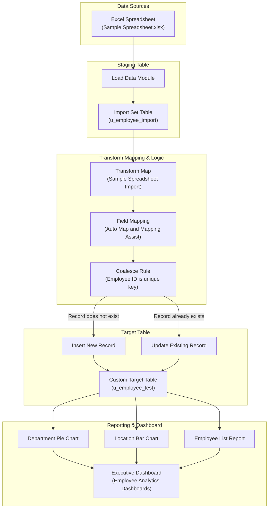

---

## Project File Structure

```text
.
├── README.md                           # Main project documentation for review
├── .gitignore                          # Git ignore rules for system and temporary files
├── dataset/
│   └── Sample Spreadsheet.xlsx         # Source Excel file with 12 employee records
└── screenshots/
    ├── 01_custom_table_schema.png      # Milestone 1: Custom table fields in ServiceNow
    ├── 02_form_layout_fields.png       # Milestone 1: Configured form layout view
    ├── 03_load_data_import_set.png     # Milestone 2: Staging table load completion
    ├── 04_transform_map_field_mapping.png # Milestone 2: Field mapping configuration
    ├── 05_transform_execution_complete.png # Milestone 3: Initial transform result (10 inserts)
    ├── 06_target_table_records_verified.png # Milestone 3: Target table record list
    ├── 07_coalesce_enabled.png         # Milestone 3: Coalesce set to true on Employee ID
    ├── 08_new_data_import_loaded.png   # Milestone 3: Load Data for updated records
    ├── 09_coalesce_transform_results.png # Milestone 3: Transform results with updates
    ├── 10_updated_target_records_verified.png # Milestone 3: Final 12 records in target table
    ├── 11_report_employees_by_department.png # Milestone 4: Pie chart report by Department
    ├── 12_report_employees_by_location.png   # Milestone 4: Bar chart report by Location
    └── 13_employee_analytics_dashboard.png # Milestone 4: Dashboard with all three reports
```

---

## Project Milestones and Implementation

### Milestone 1: Target Table and Form Layout
**Owner:** Daniel Jeewins J

1. **Source Data Preparation:**
   A source spreadsheet named `Sample Spreadsheet.xlsx` was created with six standard columns: Employee ID, First Name, Last Name, Email, Department, and Location.

2. **Custom Target Table (`u_employee_test`):**
   A new table was created under **System Definition > Tables** in the Global application scope. Five custom string fields were added:

| Column Label | Column Name | Type | Max Length | Mandatory | Purpose |
| :--- | :--- | :--- | :--- | :--- | :--- |
| Employee ID | `u_employee_id` | String | 40 | Yes | Unique identifier for each employee |
| Employee Name | `u_employee_name` | String | 100 | Yes | Full employee name |
| Email | `u_email` | String | 100 | No | Work email address |
| Department | `u_department` | String | 100 | No | Department name |
| Location | `u_location` | String | 100 | No | Office location |

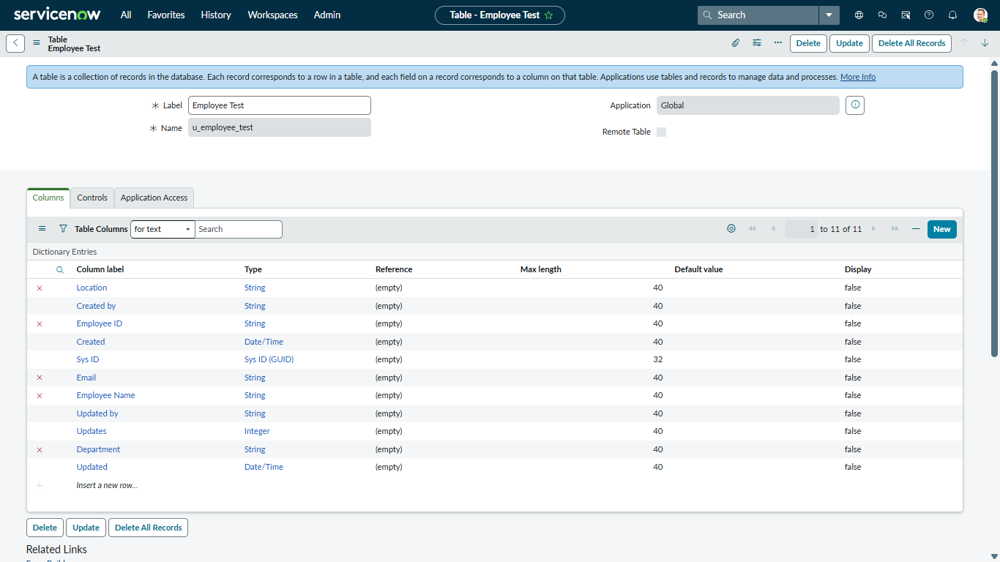
*Figure 1.1: Table columns and schema definition for u_employee_test.*

3. **Form Layout Design:**
   The form view was configured using Form Design so that all five fields are arranged neatly in a two-column view for clean data entry and reading.

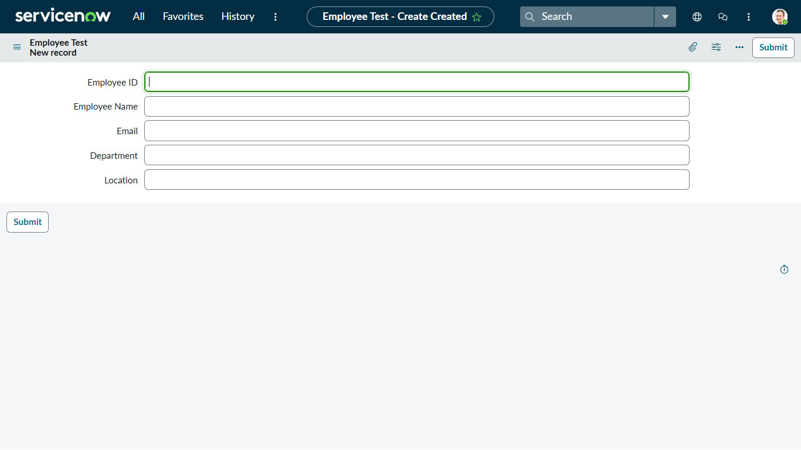
*Figure 1.2: Form view layout showing all five fields placed on the main form.*

---

### Milestone 2: Staging Table and Transform Map
**Owner:** Vishal K

1. **Loading Data into Staging Table (`u_employee_import`):**
   Using **System Import Sets > Load Data**, the spreadsheet was uploaded to create a new staging table called `Employee Import` (`u_employee_import`). Ten initial records were loaded successfully with zero errors.

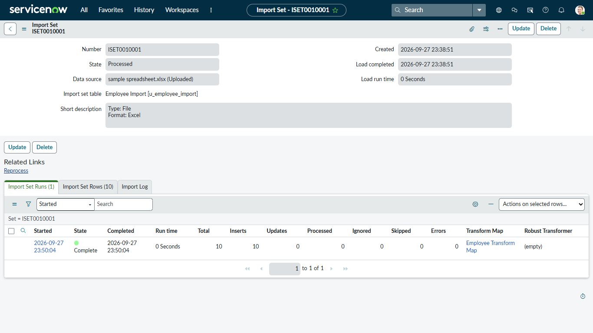
*Figure 2.1: Confirmation screen showing records loaded into staging table.*

2. **Creating the Transform Map:**
   A Transform Map named `Sample Spreadsheet Import` was created to connect the staging table (`u_employee_import`) to the target table (`u_employee_test`).

3. **Field Mapping:**
   - Fields with identical names were mapped automatically using **Auto Map Matching Fields**.
   - Because the source had `First Name` and the target table expected `Employee Name`, **Mapping Assist** was used to link `u_first_name` directly to `u_employee_name`.

| Source Field (`u_employee_import`) | Target Field (`u_employee_test`) | Mapping Method | Initial Coalesce |
| :--- | :--- | :--- | :--- |
| `u_employee_id` | `u_employee_id` | Auto Map Matching Fields | False |
| `u_first_name` | `u_employee_name` | Mapping Assist | False |
| `u_email` | `u_email` | Auto Map Matching Fields | False |
| `u_department` | `u_department` | Auto Map Matching Fields | False |
| `u_location` | `u_location` | Auto Map Matching Fields | False |

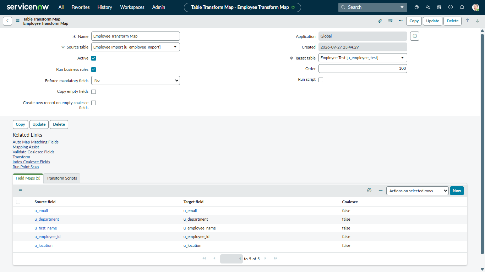
*Figure 2.2: Field mapping configuration showing links between staging and target fields.*

---

### Milestone 3: Execution, Coalesce Setup, and Data Updates
**Owner:** Mathesh G (Team Lead)

1. **Initial Transformation:**
   The Transform Map was executed for the first time. All 10 staging records were inserted into `u_employee_test` with 0 updates and 0 errors.

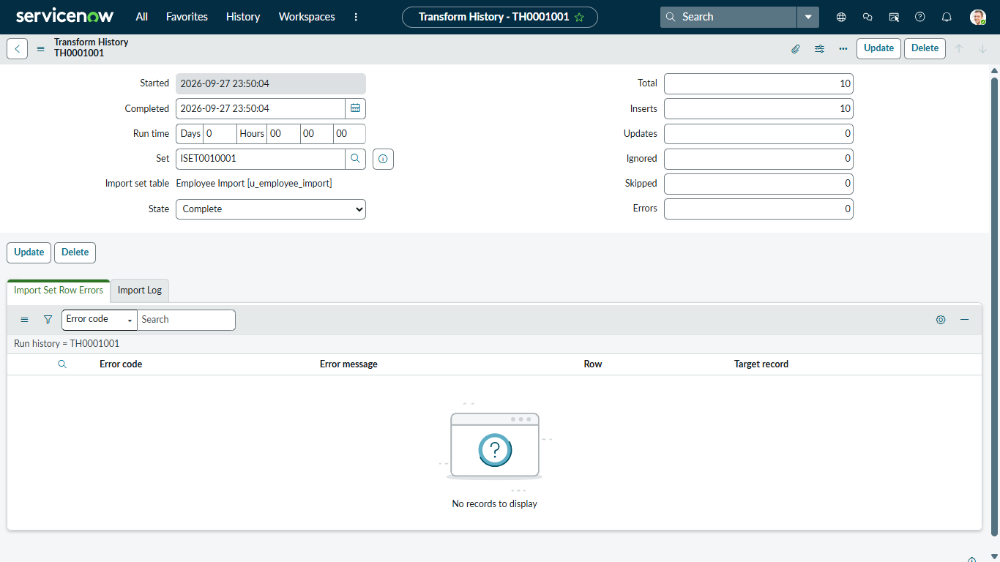
*Figure 3.1: Execution history confirming 10 records inserted into target table.*

The list view `u_employee_test.list` was opened to confirm that all 10 employees were present with their data intact.

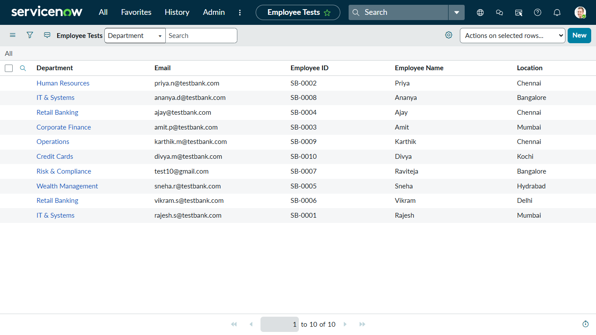
*Figure 3.2: Record list view confirming all 10 baseline records.*

2. **Enabling the Coalesce Rule:**
   In the Transform Map Field Maps list, the mapping for `u_employee_id` was opened, and **Coalesce** was checked to `true`.

   **Why Coalesce is Important:**
   Without Coalesce, running an import multiple times would create duplicate records for every employee. Setting Coalesce to `true` on Employee ID tells ServiceNow to use this field as a unique match:
   - If an employee ID already exists in the target table, ServiceNow **updates** the existing record instead of creating a new one.
   - If an employee ID does not exist, ServiceNow **inserts** a new record.
   - If the incoming data is identical, ServiceNow leaves the record alone.

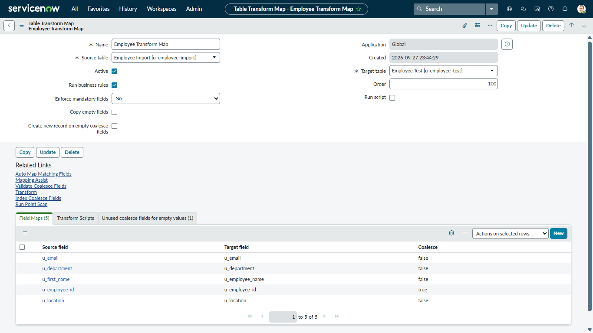
*Figure 3.3: Field map showing Coalesce set to true on u_employee_id.*

3. **Testing Data Updates and New Inserts:**
   An updated spreadsheet was prepared to verify that the Coalesce rule works as expected:
   - Record `SB-0004`: Name was changed to `Ajay Kumar`.
   - Record `SB-0007`: Email was changed to `test18@gmail.com`.
   - Record `SB-0011`: New employee `Suresh K` was added.
   - Record `SB-0012`: New employee `Meena R` was added.

   The file was loaded into the staging table and transformed.

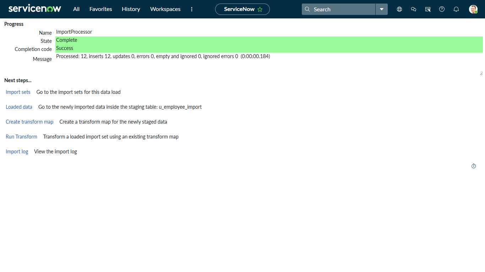
*Figure 3.4: Staging table load screen for the updated spreadsheet.*

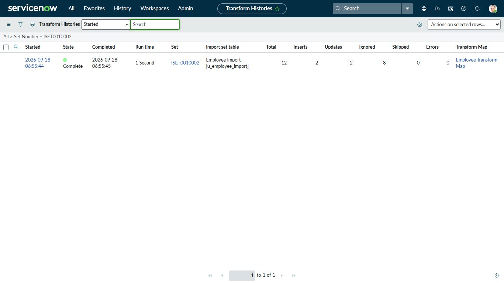
*Figure 3.5: Transform execution history showing successful updates and new inserts.*

4. **Target Table Record Verification:**
   Opening `u_employee_test.list` confirmed that the target table now contains exactly 12 records. The existing records were updated in place, and the new records were inserted without any duplicates.

| Employee ID | Employee Name | Email | Department | Location | Result |
| :--- | :--- | :--- | :--- | :--- | :--- |
| `SB-0004` | Ajay Kumar | `ajay@testbank.com` | Retail Banking | Chennai | Updated |
| `SB-0007` | Raviteja | `test18@gmail.com` | Risk & Compliance | Bangalore | Updated |
| `SB-0001` | Rajesh | `rajesh.s@testbank.com` | IT & Systems | Mumbai | Existing |
| `SB-0002` | Priya | `priya.n@testbank.com` | Human Resources | Chennai | Existing |
| `SB-0003` | Amit | `amit.p@testbank.com` | Corporate Finance | Mumbai | Existing |
| `SB-0005` | Sneha | `sneha.r@testbank.com` | Wealth Management | Hydrabad | Existing |
| `SB-0006` | Vikram | `vikram.s@testbank.com` | Retail Banking | Delhi | Existing |
| `SB-0008` | Ananya | `ananya.d@testbank.com` | IT & Systems | Bangalore | Existing |
| `SB-0009` | Karthik | `karthik.m@testbank.com` | Operations | Chennai | Existing |
| `SB-0010` | Divya | `divya.m@testbank.com` | Credit Cards | Kochi | Existing |
| `SB-0011` | Suresh | `suresh.k@testbank.com` | Operations | Chennai | New Insert |
| `SB-0012` | Meena | `meena.r@testbank.com` | Human Resources | Bangalore | New Insert |

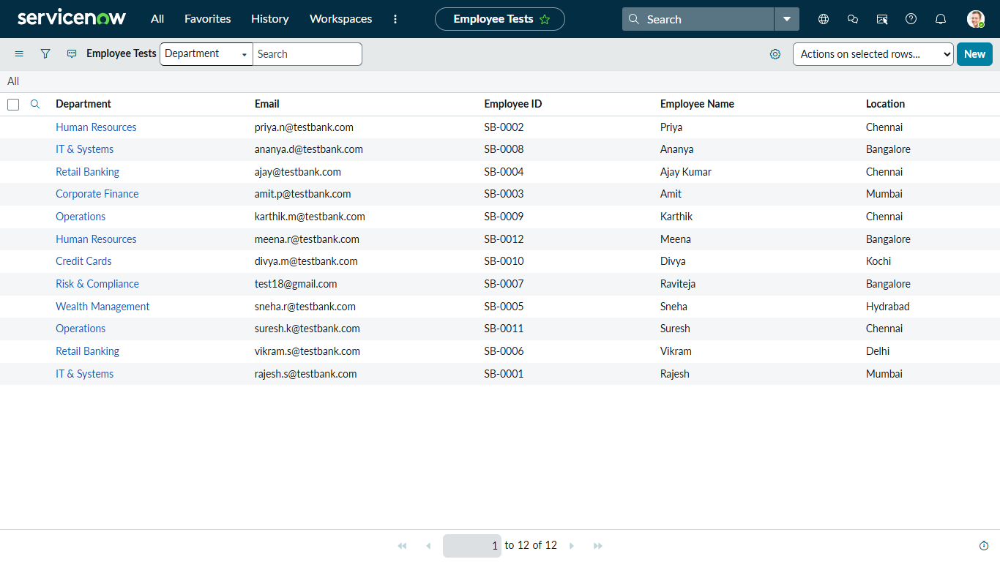
*Figure 3.6: Target table list showing all 12 records with updates applied.*

---

### Milestone 4: Reports and Executive Dashboard
**Owner:** Manikandan S

1. **Creating Analytics Reports:**
   Three reports were built on the `u_employee_test` table under **Reports > Create New**:
   - **Report 1 (Employees by Department):** A Pie Chart grouped by department, showing how employees are distributed across banking divisions.
   - **Report 2 (Employees by Location):** A Bar Chart grouped by location, displaying employee counts across cities.
   - **Report 3 (Employee List Report):** A simple list view showing all five columns for detailed record viewing.

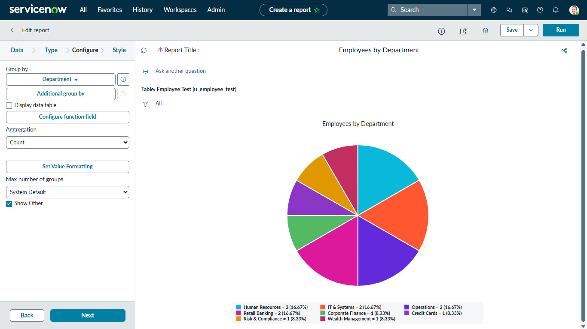
*Figure 4.1: Pie chart showing employee distribution by department.*

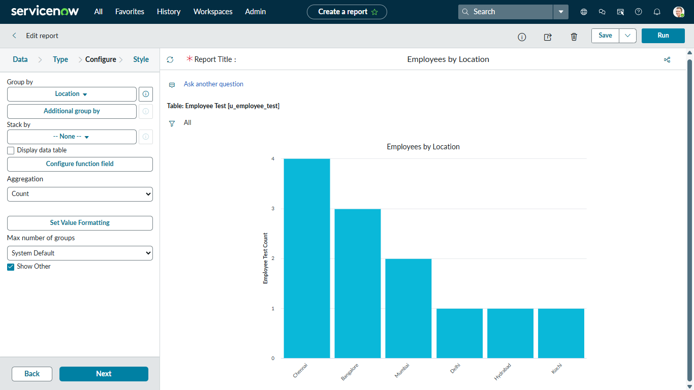
*Figure 4.2: Bar chart showing employee distribution by location.*

2. **Building the Executive Dashboard:**
   A new dashboard titled `Employee Analytics Dashboards` was created under **Self-Service > Dashboards**. All three reports were added as widgets:
   - Department Pie Chart on the top left.
   - Location Bar Chart on the top right.
   - Employee List Report across the bottom.

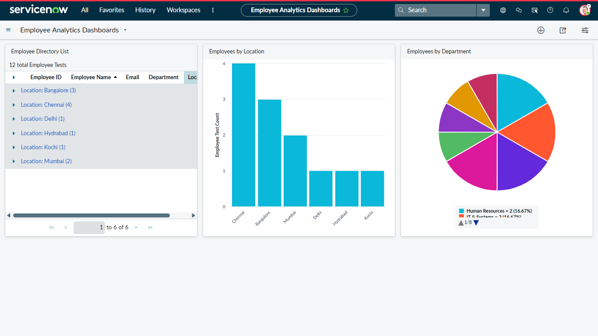
*Figure 4.3: Executive Dashboard displaying all three reports on one screen.*

---

## Evaluation Checklist

This checklist summarizes the deliverables completed for evaluation:

- [x] Baseline dataset created with 10 records and 6 columns.
- [x] Custom table `u_employee_test` created with 5 string fields.
- [x] Form view configured with clean two-column field layout.
- [x] Staging table `u_employee_import` created through Load Data.
- [x] Transform Map created with Auto Map and Mapping Assist.
- [x] Initial transformation executed with 10 records inserted and 0 errors.
- [x] Coalesce enabled on `u_employee_id` to prevent duplicates.
- [x] Updated spreadsheet loaded and transformed to test updates and new inserts.
- [x] Target table verified with 12 total records.
- [x] Three reports created (Department Pie Chart, Location Bar Chart, List Report).
- [x] Dashboard created with all three reports embedded.
- [x] All 9 SkillWallet tasks moved to review status.

---

## Project Links

| Deliverable | Link |
| :--- | :--- |
| GitHub Repository | [GitHub Repository](https://github.com/mathesh-gdev/import-data-using-transform-maps-spreadsheet) |
| Source Dataset | [dataset/Sample Spreadsheet.xlsx](dataset/Sample%20Spreadsheet.xlsx) |

---
*Naan Mudhalvan - SkillWallet Project Submission | ServiceNow System Administrator Track*
